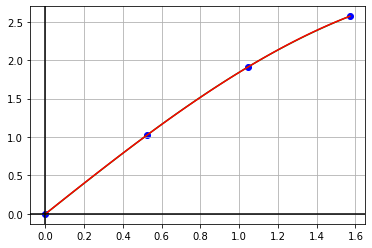
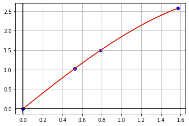

# Интерполяционные многочлены Лагранжа и Ньютона

Запустите в терминале программу на **С++** при помощи команд
```
make
make run
```
В двух появившихся файлах `answer_NN.txt` можно увидеть полученные интерполяционные полиномы. Возьмем их коэффициенты:


```python
coefficients_a = [-0.113872, -0.0654712, 2.02043, 0]
coefficients_b = [-0.121411, -0.0496813, 2.01423, 0]
```

И посторим соответствующие графики


```python
import numpy as np
import matplotlib.pyplot as plt


def function(x):
    return np.sin(x) + x


def draw(x, y, a):
    X = np.linspace(x[0], x[-1], 100)
    Y = a[0] * X ** 3 + a[1] * X ** 2 + a[2] * X + a[3]

    plt.plot(X, function(X), "-g")
    plt.plot(X, Y, "-r")

    plt.grid(True, which='both')
    plt.axhline(y=0, color='k')
    plt.axvline(x=0, color='k')
    plt.scatter(x, y, c="blue")
    plt.show()
```

## a)


```python
X = [0, np.pi/6, 2*np.pi/6, 3*np.pi/6]
Y = [function(x) for x in X]

draw(X, Y, coefficients_a)
```


    

    


## б)


```python
X = [0, np.pi/6, np.pi/4, np.pi/2]
Y = [function(x) for x in X]

draw(X, Y, coefficients_b)
```


    

    

