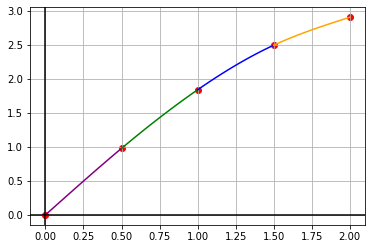

# Кубический сплайн

Запустите в терминале программу на **С++** при помощи команд
```
make
make run
```
В появившемся файле `answer_NN.txt` можно увидеть полученные коэффициенты участков сплайна:


```python
coefficients = [
    [0.0000, 2.0010, 0.0000, -0.1686],
    [0.9794, 1.8746, -0.2529, -0.0958],
    [1.8415, 1.5498, -0.3966, -0.1579],
    [2.4975, 1.0347, -0.6334, 0.4223]
]
```

Проверим их


```python
import numpy as np
import matplotlib.pyplot as plt


def draw(x, y, a):
    colors = ["purple", "green", "blue", "orange"]
    for i in range(1, len(x)):
        X = np.linspace(x[i - 1], x[i], 100)
        Y = a[i - 1][0] + a[i - 1][1] * (X - x[i - 1]) + a[i - 1][2] * (
            X - x[i - 1]) ** 2 + a[i - 1][3] * (X - x[i - 1]) ** 3
        plt.plot(X, Y, c=colors[i-1])
    plt.grid(True, which='both')
    plt.axhline(y=0, color='k')
    plt.axvline(x=0, color='k')
    plt.scatter(x, y, c="red")
    plt.show()

X = [0.0, 0.5,     1.0,    1.5,    2.0]
Y = [0.0, 0.97943, 1.8415, 2.4975, 2.9093]

draw(X, Y, coefficients)
```


    

    

