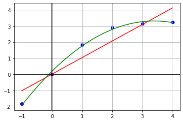

# МНК

Запустите в терминале программу на **С++** при помощи команд
```
make
make run
```
В появившемся файле `answer_NN.txt` можно увидеть полученные коэффициенты приближающих многочленов первой и второй степени соответственно:


```python
coefficients_1 = [0.0097, 1.0261]
coefficients_2 = [0.1899, 1.8370, -0.2703]
```

Проверим их


```python
import numpy as np
import matplotlib.pyplot as plt

def draw(l, r, x, y, a1,a2):
    X = np.linspace(l, r, 100)
    Y1 = a1[0] + a1[1] * X
    Y2 = a2[0] + a2[1] * X + a2[2] * X ** 2
    
    plt.plot(X, Y1, "-r")
    plt.plot(X, Y2, "-g")
    
    plt.grid(True, which='both')
    plt.axhline(y=0, color='k')
    plt.axvline(x=0, color='k')
    
    plt.scatter(x, y, c ="blue")
    plt.show()

X = [-1.0,    0.0, 1.0,    2.0,    3.0,    4.0]
Y = [-1.8415, 0.0, 1.8415, 2.9093, 3.1411, 3.2432]

draw(X[0], X[-1], X, Y, coefficients_1, coefficients_2)
```


    

    

