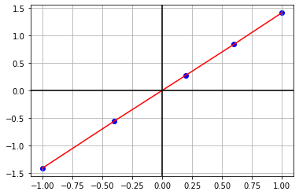

# Анализ таблично заданной функции 

|$i$| 0|    1|     2|     3|     4|
|:-:|:-:|:-:|:-:|:-:|:-:|
|$x_i$|-1.0|    -0.4|     0.2|     0.6|     1.0|
|$y_i$|-1.4142| -0.55838| 0.27870| 0.84008| 1.4142|

Построим ее график


```python
import matplotlib.pyplot as plt


def draw(x, y):
    plt.plot(x, y, "-r")

    plt.grid(True, which='both')
    plt.axhline(y=0, color='k')
    plt.axvline(x=0, color='k')

    plt.scatter(x, y, c="blue")
    plt.show()


X = [-1.0,    -0.4,     0.2,     0.6,     1.0]
Y = [-1.4142, -0.55838, 0.27870, 0.84008, 1.4142]

draw(X, Y)
```


    

    


Как видим, это прямая. Составим ее уравнение:


```python
k = (Y[0] - Y[-1]) / (X[0] - X[-1])
b = Y[-1] - k * X[-1]

print(f"f(x) = {k}*x + {b}")
```

    f(x) = 1.4142*x + 0.0
    

Первая и вторая производные соответственно равны:


```python
x_0 = 0.2
print(f"f'({x_0}) = {k:0.2f}")
print(f"f''({x_0}) = {0:0.2f}")
```

    f'(0.2) = 1.41
    f''(0.2) = 0.00
    

# Численное решение

Теперь запустите в терминале программу на **С++** при помощи команд
```
make
make run
```
В появившемся файле `answer_NN.txt` можно увидеть полученное численное решение:


```python
answer_nn = [1.4001, 0.0166]
print(f"f'({x_0}) = {answer_nn[0]:0.2f}")
print(f"f''({x_0}) = {answer_nn[1]:0.2f}")
```

    f'(0.2) = 1.40
    f''(0.2) = 0.02
    
