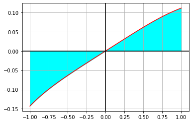

# Анализ функции 

Посмотрим на график функции:


```python
import matplotlib.pyplot as plt
import numpy as np

x = np.linspace(-1, 1, 100)
y = x / (x ** 3 + 8.0) # вариант 12

plt.plot(x, y,color="red")
plt.fill_between(x, y, np.zeros_like(y), color='cyan')

plt.grid(True, which='both')
plt.axhline(y=0, color='k')
plt.axvline(x=0, color='k')

plt.show()
```


    

    


Посмотрим на значение интеграла:


```python
from scipy.integrate import quad
def integrand(x):
    return x / (x ** 3 + 8.0)

I, EPS = quad(integrand, -1, 1)
print(I)

```

    -0.006294843240543573
    

# Численное решение

Теперь запустите в терминале программу на **С++** при помощи команд
```
make
make run
```
В появившемся файле `answer_NN.txt` можно увидеть полученные численные решения:


```python
half_step = [-0.00501867,
             -0.00891331,
             -0.00631688]

quarter_step = [-0.0059615,
                -0.00696599,
                -0.00629633]
print("Значения интеграла, полученные с шагом 0.5:", half_step)
print("Значения интеграла, полученные с шагом 0.25:", quarter_step)
```

    Значения интеграла, полученные с шагом 0.5: [-0.00501867, -0.00891331, -0.00631688]
    Значения интеграла, полученные с шагом 0.25: [-0.0059615, -0.00696599, -0.00629633]
    
