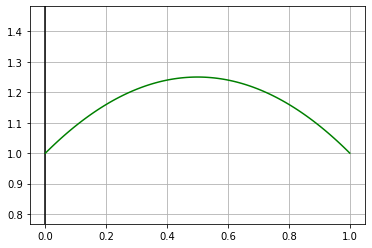
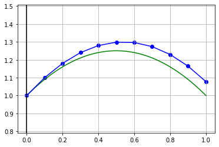
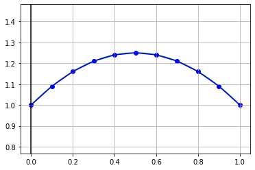

# Задача Коши

Посмотрим на график точного решения на отрезке `[0, 1]`:


```python
import numpy as np
import matplotlib.pyplot as plt

def y_true(x):
    return x - x ** 2 + 1

l = 0.0
r = 1.0

plt.axis('equal')
plt.grid(True, which='both')
plt.axvline(x=0, color='k')

X = np.linspace(l, r, 100)
plt.plot(X, y_true(X), "-g")

plt.show()
```


    

    


# Численное решение

Теперь запустите в терминале программу на **С++** при помощи команд
```
make
make run
```
В появившемся файле `answer_NN.txt` можно увидеть полученные численные решения. Проверим их, построив полученные точки на графике


```python
def draw(l, r, x, y):
    plt.axis('equal')
    plt.grid(True, which='both')
    plt.axvline(x=0, color='k')

    X = np.linspace(l, r, 100)
    plt.plot(X, y_true(X), "-g")

    plt.scatter(x, y, c ="blue")
    plt.plot(x, y, "-b")
    
    plt.show()
```

Метод Эйлера


```python
X = [0.000000, 0.100000, 0.200000, 0.300000, 0.400000, 0.500000, 0.600000, 0.700000, 0.800000, 0.900000, 1.000000]
Y = [1.000000, 1.100000, 1.180000, 1.239802, 1.279212, 1.298042, 1.296116, 1.273267, 1.229341, 1.164197, 1.077706]
draw(l, r, X, Y)
```


    

    


Метод Рунге-Кутты


```python
X = [0.000000, 0.100000, 0.200000, 0.300000, 0.400000, 0.500000, 0.600000, 0.700000, 0.800000, 0.900000, 1.000000]
Y = [1.000000, 1.090000, 1.160000, 1.210000, 1.240000, 1.250001, 1.240001, 1.210002, 1.160002, 1.090003, 1.000004]
draw(l, r, X, Y)
```


    

    


Метод Адамса


```python
X = [0.000000, 0.100000, 0.200000, 0.300000, 0.400000, 0.500000, 0.600000, 0.700000, 0.800000, 0.900000, 1.000000]
Y = [1.000000, 1.090000, 1.160000, 1.210000, 1.240001, 1.250001, 1.240002, 1.210002, 1.160003, 1.090003, 1.000004]
draw(l, r, X, Y)
```


    

    

