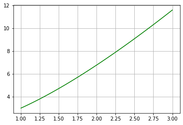
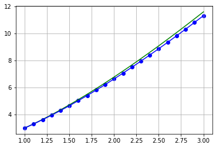
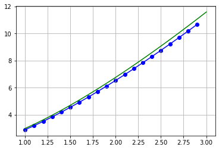

# Краевая задача

Посмотрим на график точного решения на отрезке `[1, 3]`:


```python
import numpy as np
import matplotlib.pyplot as plt

def y_true(x):
    return 2 + x + 2 * x * np.log(np.abs(x))

a = 1.0
b = 3.0

plt.grid(True, which='both')
X = np.linspace(a, b, 100)
plt.plot(X, y_true(X), "-g")
plt.show()
```


    

    


# Численное решение

Теперь запустите в терминале программу на **С++** при помощи команд
```
make
make run
```
В появившемся файле `answer_NN.txt` можно увидеть полученные численные решения. Проверим их, построив полученные точки на графике


```python
def draw(l, r, x, y):
    plt.grid(True, which='both')

    X = np.linspace(l, r, 100)
    plt.plot(X, y_true(X), "-g")

    plt.scatter(x, y, c ="blue")
    plt.plot(x, y, "-b")
    
    plt.show()
```

Метод стрельбы


```python
X = [1.000000, 1.100000, 1.200000, 1.300000, 1.400000, 1.500000, 1.600000, 1.700000, 1.800000, 1.900000, 2.000000, 2.100000, 2.200000, 2.300000, 2.400000, 2.500000, 2.600000, 2.700000, 2.800000, 2.900000, 3.000000]
Y = [3.000000, 3.300000, 3.615308, 3.945925, 4.291212, 4.650418, 5.022795, 5.407643, 5.804312, 6.212204, 6.630776, 7.059527, 7.497999, 7.945772, 8.402458, 8.867698, 9.341163, 9.822545, 10.311559, 10.807938, 11.311435]

draw(a, b, X, Y)
```


    

    


Метод конечных разностей


```python
X = [1.000000, 1.100000, 1.200000, 1.300000, 1.400000, 1.500000, 1.600000, 1.700000, 1.800000, 1.900000, 2.000000, 2.100000, 2.200000, 2.300000, 2.400000, 2.500000, 2.600000, 2.700000, 2.800000, 2.900000]
Y = [2.905120, 3.205120, 3.522371, 3.855435, 4.203096, 4.564312, 4.938179, 5.323905, 5.720794, 6.128226, 6.545644, 6.972551, 7.408494, 7.853063, 8.305882, 8.766608, 9.234924, 9.710538, 10.193181, 10.682601]

draw(a, b, X, Y)
```


    

    

